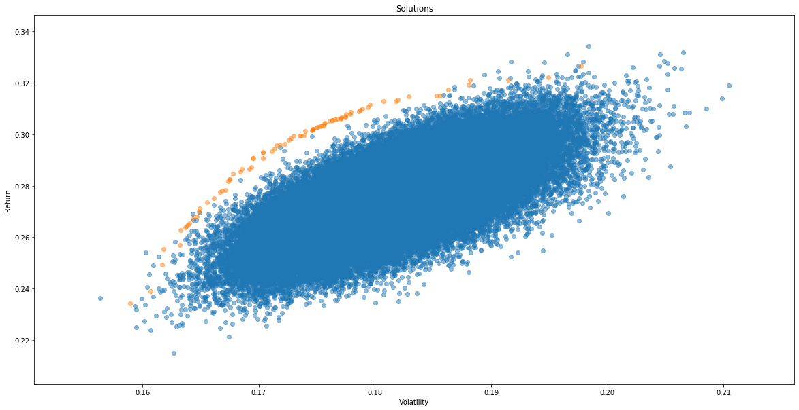
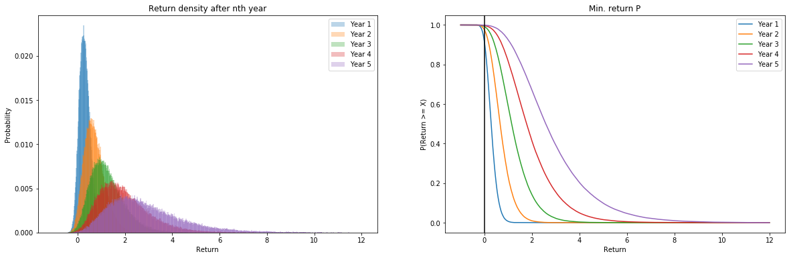
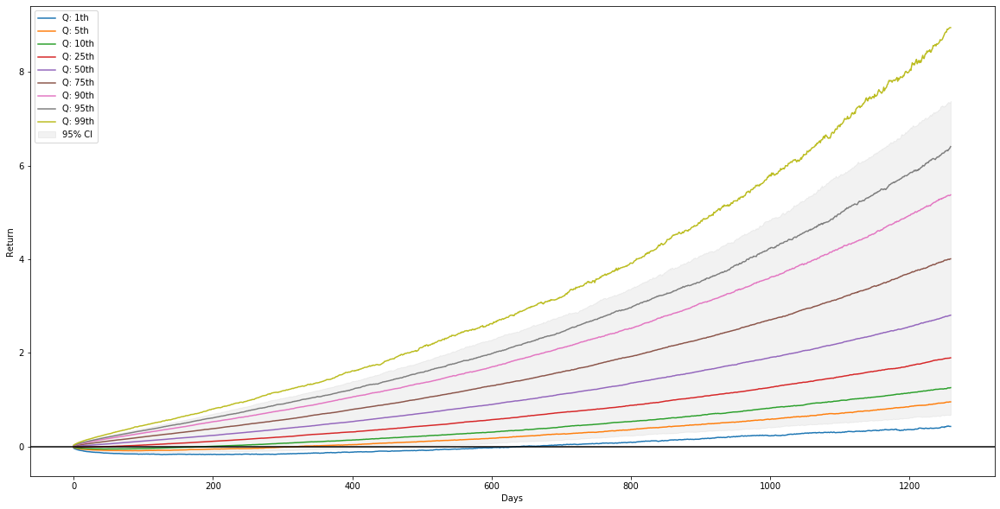
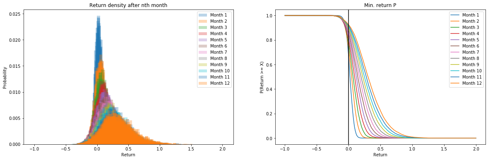
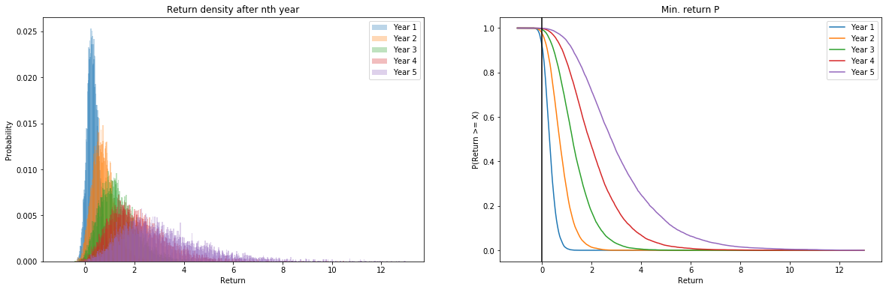

# Optfolio
This package provides a investment portfolio optimization tool that uses NSGA-II evolutionary algorithm to
approximate a Pareto optimal set of portfolio asset allocations. Returns of a particular portfolio asset
distribution can be projected into the future using Monte Carlo or Markov Chain Monte Carlo methods.

## Optimization
```python
from optfolio.optimize import Optimizer

optimizer = Optimizer()
solutions, stats = optimizer.run(returns)
```


## Monte Carlo Projection
```python
from optfolio.returns_projection import sample_returns

traces = sample_returns(ret, 5 * 252, n_traces = 100000)
plot_traces(traces)
```




## MCMC Projection
```python
from optfolio.returns_projection import mcmc_sample_returns

traces = mcmc_sample_returns(ret, 5 * 252, n_traces=100000, mc_states = 15, n_jobs=10)
plot_traces(traces)
```



